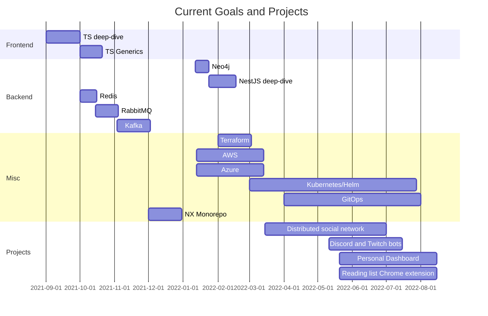

   
  

Solutions Architect & Principal Software Engineer
-------------------------------------------------

Thanks for stopping by. Here's a little bit about me: 
I am a principal developer with over 16 years of experience. I have extensive knowledge in game design, web development, and cloud architecture.

- 🌱 I’m currently learning a few different things, but have been mainly focused on Typescript, cloud architecture and IaC, and building 3D websites using @react-three/fiber.
- 💬 Ask me about Typescript, Golang, or Unity3d. That's bound to strike up a conversation.
- 🌍  I'm based in Jacksonville, Florida
- ✉️  You can contact me at [brandon@brandonmiller.io](mailto:brandon@brandonmiller.io)
- 🧠  I'm learning in-depth kubernetes and Cluster API
- 🤝  I'm open to collaborating on anything you may need help with, and all of my public projects
- ⚡ Fun fact: Performing multiplication in your code is always a fraction faster than division since, under the hood, the CPU breaks it down in to multiplication anyways. I.E. multiplying by 0.1 is faster than dividing by 100. Not a huge deal to most, but in cases where efficiency is everything, this can be a good trick to know!

⚽ Skills
----------

<table tr><td valign="top" width="33%">  

### Frontend  
    
 

  
  
  
  
  
  
  
  
  
  
  
  
  
  
  
  
  
  

</td><td valign="top" width="33%">

### Backend  

 

  
  
  
  
  
  
  
  
  
  
  
  
  
  
  
  
  
  
  
  
  

</td><td valign="top" width="33%">

    
### DevOps  

 

  
  
  
  
  
  
  
  
  
  
  
  
  
  
  

</td></tr></table>  

   

💬 Connect with me
---------------

 

 

  

  

 

💎 Widgets
----------

 

   
 

  

 

😎 Some of my favorite projects
----

🏆 Trying to avhieve Github platinum
----

